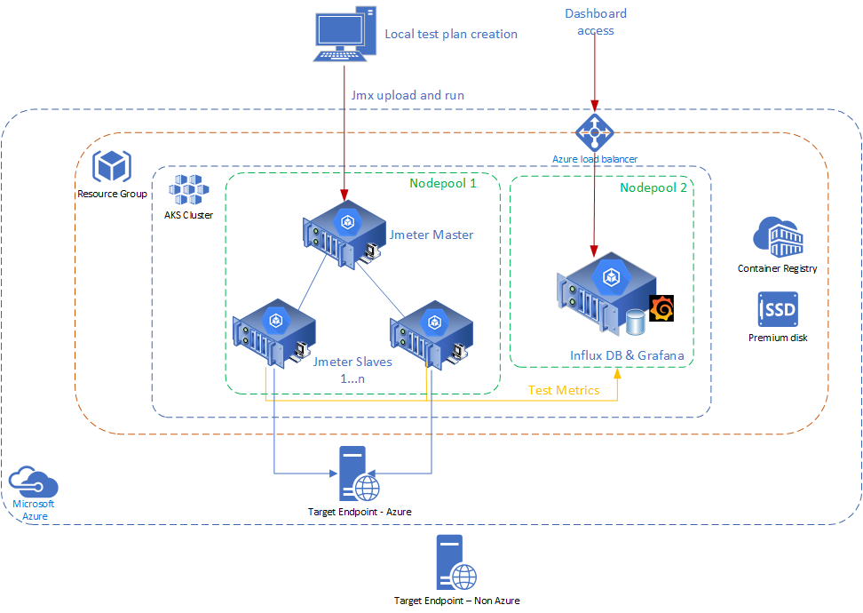
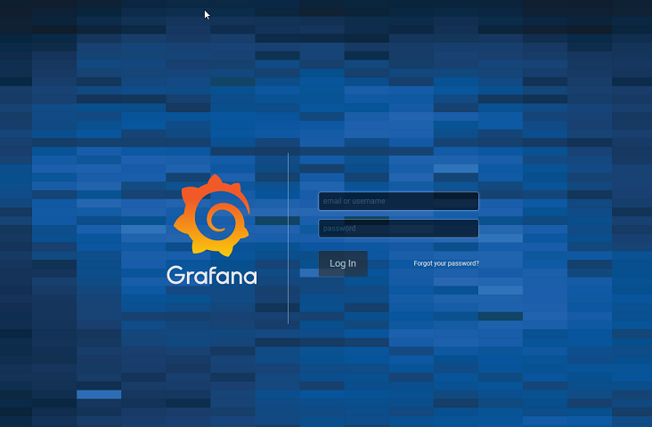
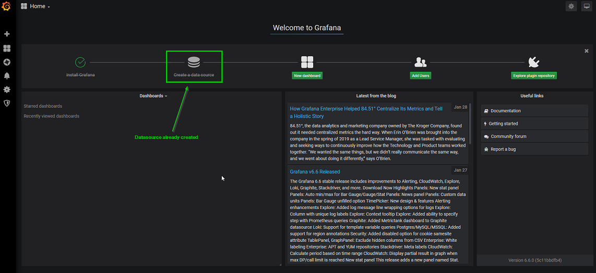
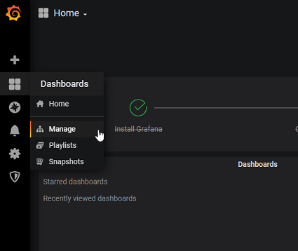
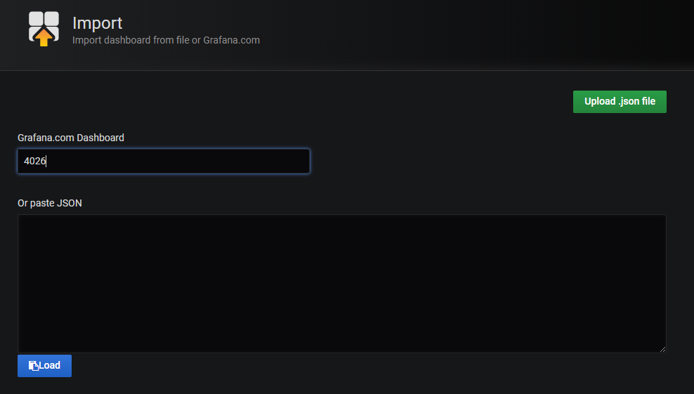
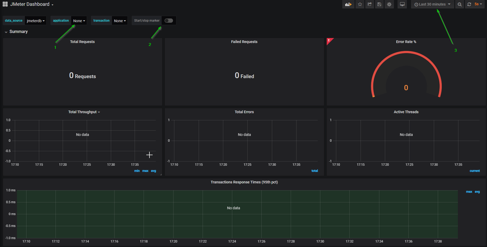

# AKS based scalable Jmeter Test Framework with Grafana

## Introduction
This Jmeter based testing framework provides a scalable test harness to support load testing of applications using Apache JmeterTM  based test scripts.  The framework excludes support for writing a Jmeter test plan but assumes a test plan in the form of a jmx files is available.  The testing framework utilizes a master Jmeter node with one or more slave nodes used to run the tests.  The deployment assumes a Jmeter backend listener is configured within the test plan to support writing metrics to the Influx database which can then be presented via a Grafana dashboard.  The initial deployment only deploys a single jmeter-slave pod but can be scaled as needed to support the required number of client threads.

## Architecture

The framework uses a Kubernetes based deployment of Apache Jmeter, InfluxDB and Grafana.  The framework builds on Apache Jmeter's distributed load testing model ( (https://jmeter.apache.org/usermanual/jmeter_distributed_testing_step_by_step.html)) whereby tests are initiated from a Jmeter master node(1) which then distributes the test script to the slaves (jmeter instances), the slaves are nodes/pods that carry out the load testing. Note: The test plan is replicated to all slaves so consideration of the overall client load is needed.  For example, a test plan with 100 client threads distributed to 5 jmeter slaves will result in 500 active clients. You will use a distributed architecture like this if you want to carry out an intensive load test which can simulate hundreds and thousands of simultaneous users, this is the scenario we will be looking at in this blog post.The results of any load testing are sent to the InfluxDB using the built in BackEndLister available in Jmeter (see test plan construction below) and Grafana is used to render this data in an easily consumable dashboard.

## Installation

### Pre-requisities
- az cli is installed (assumes use of linux based client not powershell)
- kubectl is installed ( https://kubernetes.io/docs/tasks/tools/install-kubectl/ )

1. Clone the github repo 
2. Navigate to the installs directory
3. Make the install.sh script executable 
    - chmod +x install.sh
4. Running install.sh
    - can we run with the following parameters
        #### validate
        - install.sh validate -g {resource-group-name} -l {location} -s {service-principal-name}
        - This will validate the target environment, checking resource group, service principal name and AKS

        #### install
        - install.sh install -g {resource-group-name} -s {service-principal-name} -l {location}
        - This will deploy to the target environment using the resource group and location defined.  It will create the resource group, service principal, Azure Container Registry, build and upload containers for Jmeter Master, Jmeter Slave and reporting, create an AKS cluster and deploy and configure all the elements required to run a test.

        #### delete
        - install.sh delete -g {resource-group-name} -s {service-principal-name}
        This will remove all resources and the service principal

5. Once the deployment has completed successfully the Grafana dashboard can be accessed via the public IP of the provisioned loadbalancer.  The easiest way to obtain this is to run
 - kubectl get svc

 

The public IP address of the loadbalancer can then be used to access the Grafana login window

### Set up Jmeter Dashboard
Once the Grafana dashboad has been accessed an initial dashboard should be loaded ( note: a default datasource has already been created )

Select Dashboards ....Manage as below:

This will open the Dashboard Management Window.....Select "Import"

On the Import window enter 4026 as the Id for the dashboard as below

This will import the dashboard from Grafana labs and display the settings dialog as below - update the database name as shown and select Import to load the dashboard

The Grafana Jmeter dashboard will be loaded with the default settings ready for your first Jmeter Test

## Running your first Jmeter test
